# Retcon Black Mountain - Visual Architecture Diagrams

## How to View These Diagrams

These are Mermaid diagrams. You can view them by:
1. **GitHub**: Push this file to GitHub - it will render automatically
2. **VS Code**: Install "Markdown Preview Mermaid Support" extension
3. **Online**: Copy the code to https://mermaid.live/
4. **Export**: Use mermaid.live to export as PNG/SVG

---

## 1. System Architecture Overview

```mermaid
graph TB
    subgraph "Client Browser"
        UI[Next.js React App<br/>Port: Browser]
        SearchBar[Search Bar<br/>Always Visible]
        Feed[Global Feed]
        Collections[Collections]
        Components[React Components]

        UI --> SearchBar
        UI --> Feed
        UI --> Collections
        UI --> Components
    end

    subgraph "Nginx Reverse Proxy"
        Nginx[Nginx<br/>Port 8443 HTTPS]
    end

    subgraph "Next.js Server"
        NextServer[Next.js<br/>Port 3000]
        APIRoutes[API Routes]
        AuthAPI[/api/auth/p2p/*]
        FeedAPI[/api/feed/*]
        DocsAPI[/api/documents/*]
        CollAPI[/api/collections/*]

        NextServer --> APIRoutes
        APIRoutes --> AuthAPI
        APIRoutes --> FeedAPI
        APIRoutes --> DocsAPI
        APIRoutes --> CollAPI

        SQLite[(SQLite DB<br/>Users)]
        OrbitClient[OrbitDB Client<br/>HTTP Wrapper]

        AuthAPI --> SQLite
        FeedAPI --> OrbitClient
        DocsAPI --> OrbitClient
        CollAPI --> OrbitClient
    end

    subgraph "OrbitDB Service"
        OrbitServer[OrbitDB HTTP Server<br/>Port 4001]
        OrbitDB[(OrbitDB<br/>Distributed DB)]
        IPFS[IPFS/Helia<br/>Content Storage]
        LibP2P[libp2p Network<br/>P2P Layer]

        OrbitServer --> OrbitDB
        OrbitDB --> IPFS
        OrbitDB --> LibP2P

        WS[WebSocket<br/>Port 9091]
        OrbitDB --> WS
    end

    UI -->|HTTPS| Nginx
    Nginx --> NextServer
    OrbitClient -->|HTTP| OrbitServer

    style SearchBar fill:#4CAF50
    style Feed fill:#2196F3
    style OrbitDB fill:#FF9800
    style IPFS fill:#9C27B0
```

---

## 2. Search Flow Diagram


---

## 3. Document Edit Flow with Version History


---

## 4. Collection & Document Creation Flow

```mermaid
flowchart TD
    Start([User Creates Collection]) --> Auth{Authenticated?}
    Auth -->|No| Login[Redirect to /auth]
    Auth -->|Yes| CreateForm[Fill Collection Form<br/>Name + Description]

    CreateForm --> Submit[POST /api/collections/p2p]
    Submit --> GenID[Generate Collection ID<br/>collection-DID-timestamp]
    GenID --> OrbitCreate[OrbitDB: Create KeyValue Store]
    OrbitCreate --> StoreAddr[Get OrbitDB Address<br/>/orbitdb/zdpu...]
    StoreAddr --> Registry[Update User Registry<br/>Add collection to user's list]
    Registry --> SaveMeta[Store Collection Metadata<br/>in OrbitDB]
    SaveMeta --> Return[Return Collection Info]

    Return --> UploadDoc{Upload Document?}
    UploadDoc -->|Yes| DocType{Document Type}
    UploadDoc -->|No| End([Done])

    DocType -->|Quote| QuoteForm[Quote Form:<br/>- Content<br/>- Author<br/>- Source<br/>- Keywords]
    DocType -->|Link| LinkForm[Link Form:<br/>- URL<br/>- Title<br/>- Description<br/>- Keywords]
    DocType -->|Image| ImageForm[Image Form:<br/>- File<br/>- Metadata<br/>- Keywords]

    QuoteForm --> CreateDoc[Create Document Object]
    LinkForm --> CreateDoc
    ImageForm --> CreateDoc

    CreateDoc --> DocID[Generate doc-timestamp-random]
    DocID --> InitVersion[Set version: 1<br/>versionHistory: []]
    InitVersion --> StoreDoc[Store in Collection<br/>PUT doc-{id}]
    StoreDoc --> Broadcast[OrbitDB Broadcasts<br/>to P2P Network]
    Broadcast --> End

    style QuoteForm fill:#E1F5FE
    style LinkForm fill:#FFF9C4
    style ImageForm fill:#F3E5F5
    style OrbitCreate fill:#FF9800
    style Broadcast fill:#4CAF50
```

---

## 5. Authentication Flow


---

## 6. Component Hierarchy

```mermaid
graph TD
    App[App Root]

    App --> Theme[ThemeContext Provider<br/>Dark/Light Mode]

    Theme --> Nav[Navigation Component<br/>User Info + Links]
    Theme --> Pages[Pages]

    Pages --> Auth[/auth - Login/Register]
    Pages --> Feed[/feed - Global Feed]
    Pages --> Coll[/collections - User Collections]
    Pages --> CollID[/collections/id - Collection Detail]
    Pages --> Profile[/profile - User Profile]

    Feed --> FeedSearch[Search Bar Component<br/>ALWAYS VISIBLE]
    Feed --> FeedDocs[GlobalFeedDocuments]

    FeedSearch --> Parser[parseSearchQuery Function]
    Parser --> FeedDocs

    FeedDocs --> Grid[Document Grid<br/>Infinite Scroll]
    Grid --> QuoteCard[Quote Cards]
    Grid --> LinkCard[Link Cards]
    Grid --> ImageCard[Image Cards]

    QuoteCard --> EditModal[DocumentEditModal]
    LinkCard --> EditModal
    ImageCard --> EditModal

    QuoteCard --> VersionModal[DocumentVersionBrowser]
    LinkCard --> VersionModal
    ImageCard --> VersionModal

    CollID --> P2PDocs[P2PDocumentsApi]
    P2PDocs --> Upload[Upload Forms]
    P2PDocs --> DocList[Document List]

    style FeedSearch fill:#4CAF50,stroke:#2E7D32,stroke-width:3px
    style Feed fill:#2196F3
    style EditModal fill:#FF9800
    style VersionModal fill:#9C27B0
```

---

## 7. Data Models

```mermaid
erDiagram
    USER ||--o{ COLLECTION : creates
    COLLECTION ||--o{ DOCUMENT : contains
    DOCUMENT ||--o{ VERSION_HISTORY : tracks

    USER {
        string id PK
        string username UK
        string passwordHash
        string did UK
        number createdAt
    }

    COLLECTION {
        string id PK
        string name
        string description
        string owner FK
        number created
        number lastUpdated
        string address
        string type
    }

    DOCUMENT {
        string id PK
        string documentType
        string title
        string description
        string collectionId FK
        string uploadedBy FK
        number created
        number lastAccessed
        array replicas
        boolean pinned
        number version
        array versionHistory
        object metadata
    }

    VERSION_HISTORY {
        number version
        string editedBy
        number editedAt
        string changeComment
        object previousMetadata
    }

    QUOTE_METADATA {
        string quoteContent
        string author
        string title
        string publisher
        string year
        string pageNumbers
        array keywords
    }

    LINK_METADATA {
        string url
        string title
        string author
        string siteName
        string description
        array keywords
    }

    IMAGE_METADATA {
        string filename
        string mimeType
        string creator
        string title
        string description
        array keywords
    }

    DOCUMENT ||--o| QUOTE_METADATA : "if type=quote"
    DOCUMENT ||--o| LINK_METADATA : "if type=link"
    DOCUMENT ||--o| IMAGE_METADATA : "if type=image"
```



---

## 8. Technology Stack


---

## 9. Port Architecture


---

## How to Export as Image

### Option 1: GitHub (Easiest)
1. Commit this file to your repository
2. Push to GitHub
3. Open the file on GitHub - it will render automatically
4. Take a screenshot or use GitHub's built-in export

### Option 2: Mermaid Live Editor
1. Go to https://mermaid.live/
2. Copy any diagram code from above
3. Paste into the editor
4. Click "Actions" → "PNG" or "SVG" to download

### Option 3: VS Code
1. Install extension: "Markdown Preview Mermaid Support"
2. Open this file in VS Code
3. Click preview button
4. Right-click diagram → "Copy Image" or screenshot

### Option 4: CLI Tools
```bash
# Install mermaid-cli
npm install -g @mermaid-js/mermaid-cli

# Convert to image
mmdc -i ARCHITECTURE_MERMAID.md -o architecture.png
```

---

## Recommended Viewing Order

1. **System Architecture Overview** - See the big picture
2. **Search Flow Diagram** - Understand the main feature
3. **Component Hierarchy** - Learn the UI structure
4. **Document Edit Flow** - See version history in action
5. **Data Models** - Understand the data structure
6. **Technology Stack** - Know the tools used

Each diagram can be exported separately as needed!
