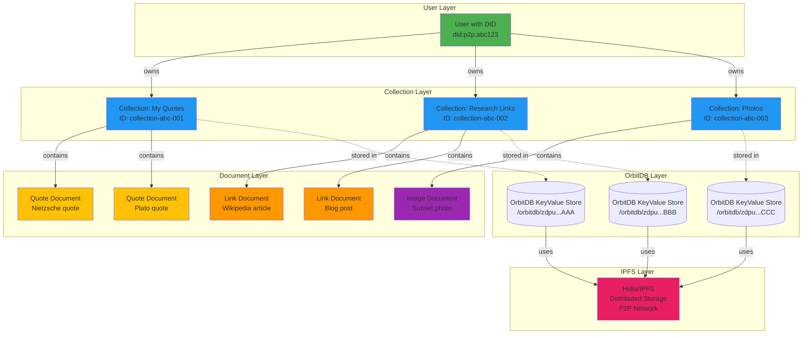
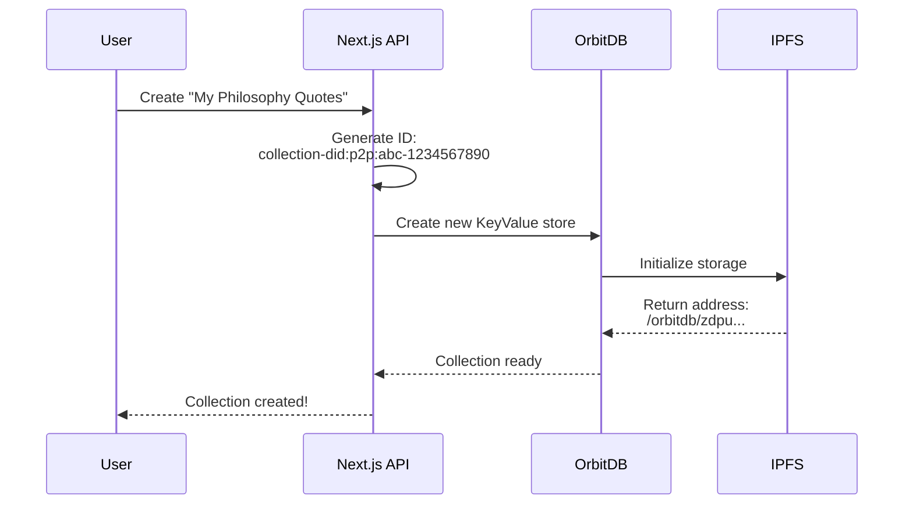
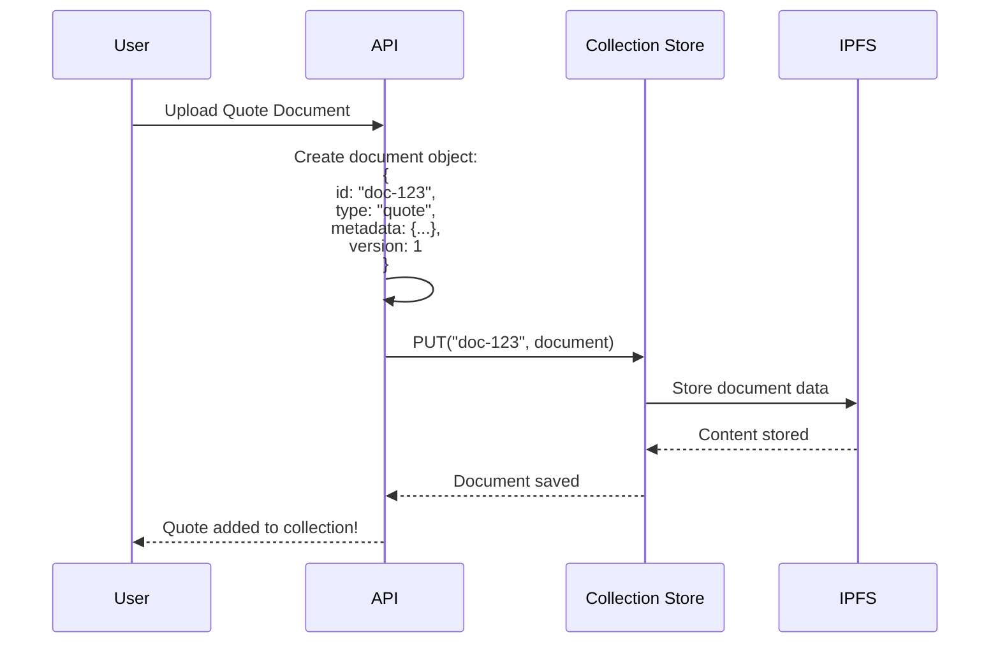
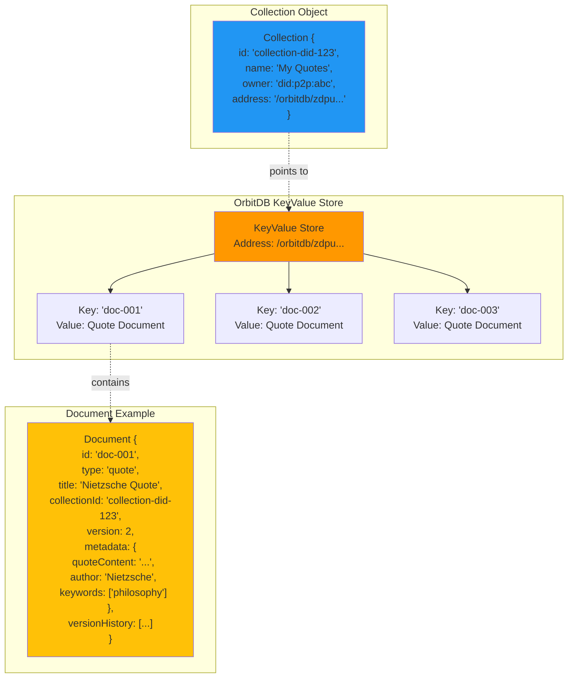
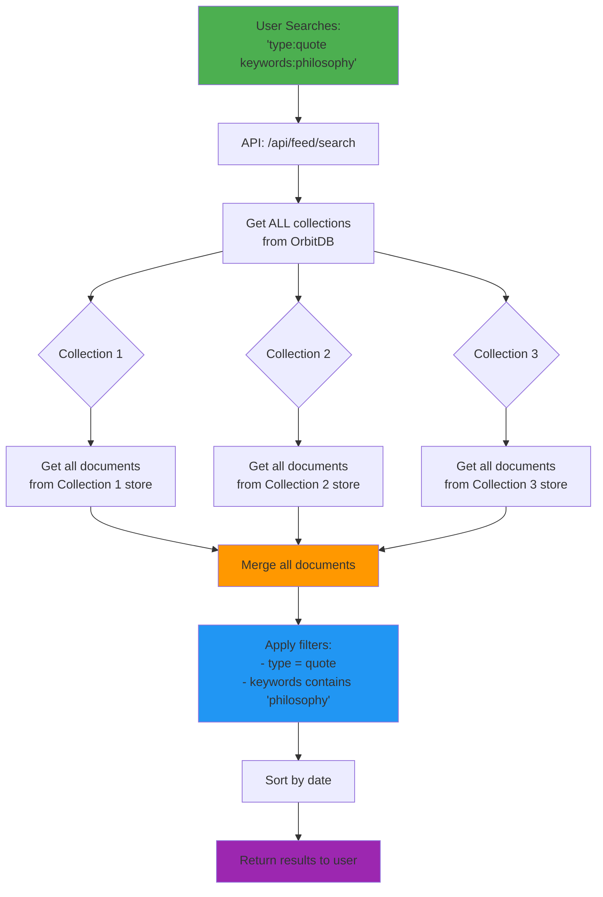

# Collections, Documents & OrbitDB Architecture

## Simple Overview Diagram



---

## How It Works Step-by-Step

### 1. **User Creates a Collection**



**What happens:**
- Each collection gets a unique ID
- OrbitDB creates a dedicated KeyValue database for it
- This database gets an IPFS address
- All documents in this collection will be stored in this database

---

### 2. **User Adds Documents to Collection**



**What happens:**
- Document is created with unique ID
- Stored in the collection's OrbitDB KeyValue store
- Key = document ID (e.g., "doc-123")
- Value = entire document object
- IPFS handles the actual storage and replication

---

### 3. **Data Structure Deep Dive**



---

### 4. **Searching Across All Collections**



**What happens:**
- API fetches list of all collections
- Opens each collection's OrbitDB store
- Gets all documents from each store
- Merges them into one big list
- Applies search filters
- Returns matching documents

---

## Key Concepts

### Collection = Container
```
Collection "My Philosophy Quotes"
├── Quote from Nietzsche
├── Quote from Plato
└── Quote from Aristotle
```

### OrbitDB = Database per Collection
```
Collection "My Philosophy Quotes"
    ↓
OrbitDB KeyValue Store (/orbitdb/zdpu...ABC)
    ↓
IPFS Distributed Storage
```

### Document = Individual Item
```
Document {
  id: "doc-001",
  type: "quote",
  collectionId: "collection-123",
  metadata: {
    quoteContent: "That which does not kill us...",
    author: "Friedrich Nietzsche",
    keywords: ["philosophy", "strength"]
  },
  version: 1
}
```

---

## Why This Architecture?

1. **Decentralized**: Each collection is a separate OrbitDB database
2. **P2P Replication**: IPFS automatically syncs data across peers
3. **Version Control**: Documents track their edit history
4. **Searchable**: Can query across all collections efficiently
5. **Ownership**: Each collection tied to a user's DID

---

## Storage Hierarchy

```
User (DID)
  └── Collections
        └── OrbitDB KeyValue Store (unique address)
              └── Documents (key-value pairs)
                    └── IPFS Blocks (distributed storage)
```

---

## View on GitHub

Once pushed to GitHub, these diagrams will render automatically!
